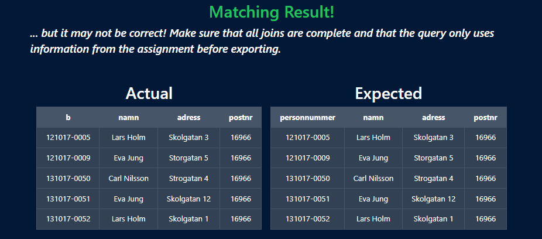
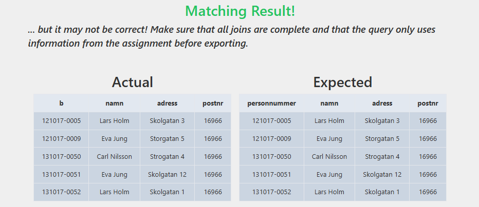
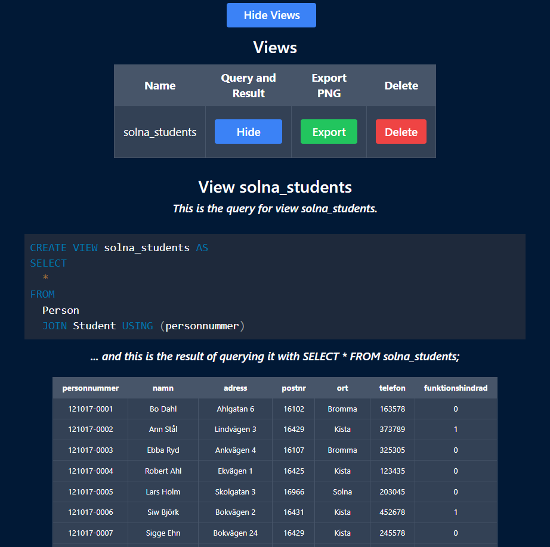
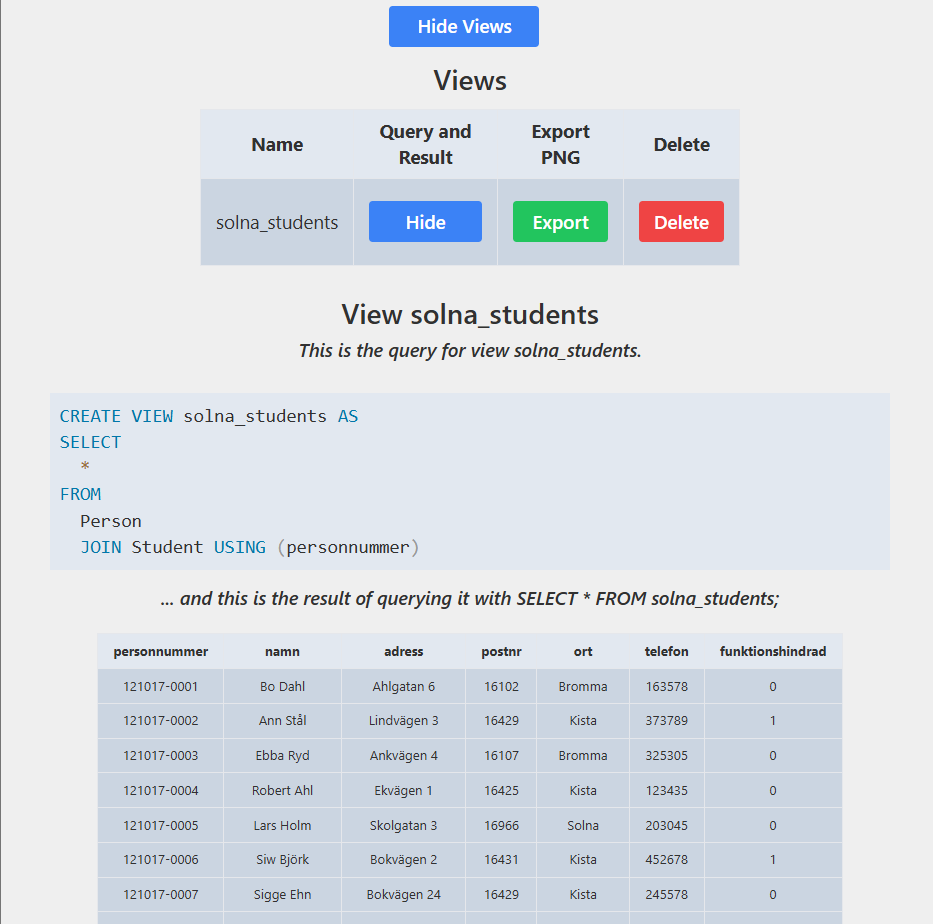
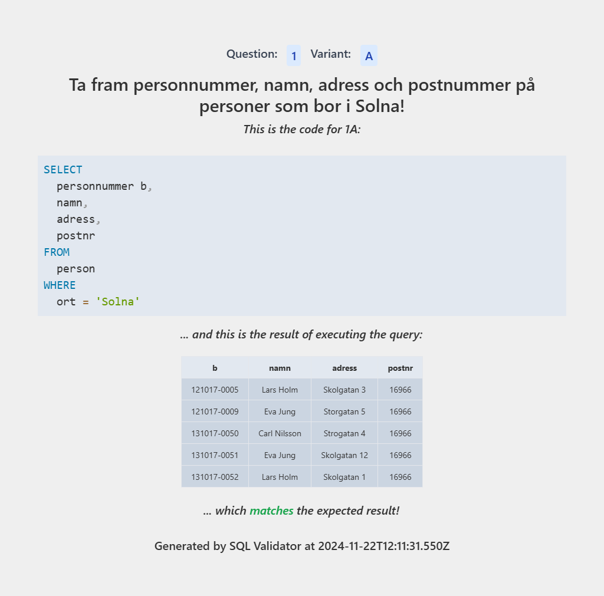
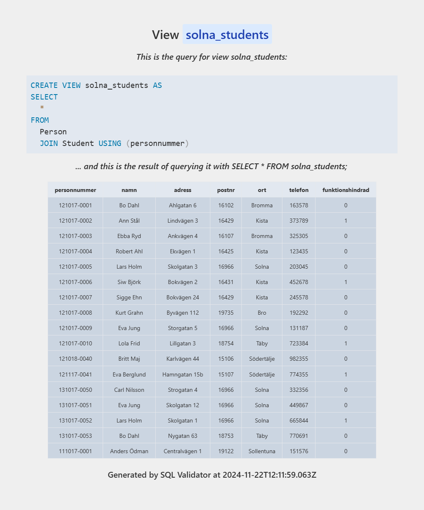

# SQL Validator
SQL Validator is a fully client-side web application powered by sql.js. Designed for the database course at Stockholm University, it provides an interface for students to write, format, and run SQL queries directly in their browser without the need for a database server. Results can be compared to expected results based on a question bank, and views can be created and managed using the browser's local storage.

## Features
- **Fully Client-Side Execution**: All SQL validation and execution is performed in the browser using sql.js SQLite.
- **SQL Editor**: A simple text editor with syntax highlighting and formatting.
- **Views Management**: Create, delete, and manage database views, stored in the browser's local storage.
- **Efficient Results Comparison**: Compare query results to expected results based on a question bank.
- **Dark/Light Mode**: Toggle between dark and light mode.
- **Question Highlighting**: Started and completed questions are highlighted in the question selector making it easy to track progress.
- **Import/Export Data**: Import and export queries and views to file for sharing and/or backups.
- **Image Export**: Export queries and views as images in light mode for assignment submission.

## Usage
### Public Deployment
A public instance of SQL Validator is available at [https://sql-validator.e-su.se](https://sql-validator.e-su.se), powered with Cloudflare Pages.

### Running Locally
To deploy SQL Validator locally, follow these steps:
1. Clone the repository: `git clone https://github.com/Edwinexd/sql-validator.git`
2. Install dependencies: `npm install`
3. Start the development server: `npm start`

## Screenshots
## Main Application

    
    

    
    

    
    

## Views

    
    

## Image Exports

    
    

## License
This project is licensed under the GNU General Public License v3.0. See the [LICENSE](LICENSE.md) file for more information.
