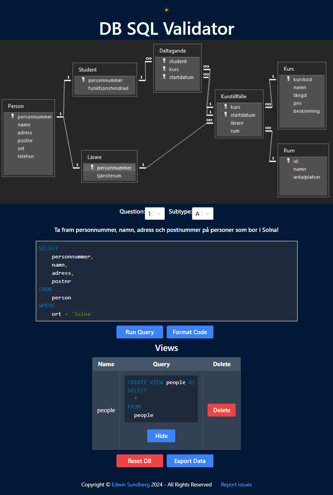
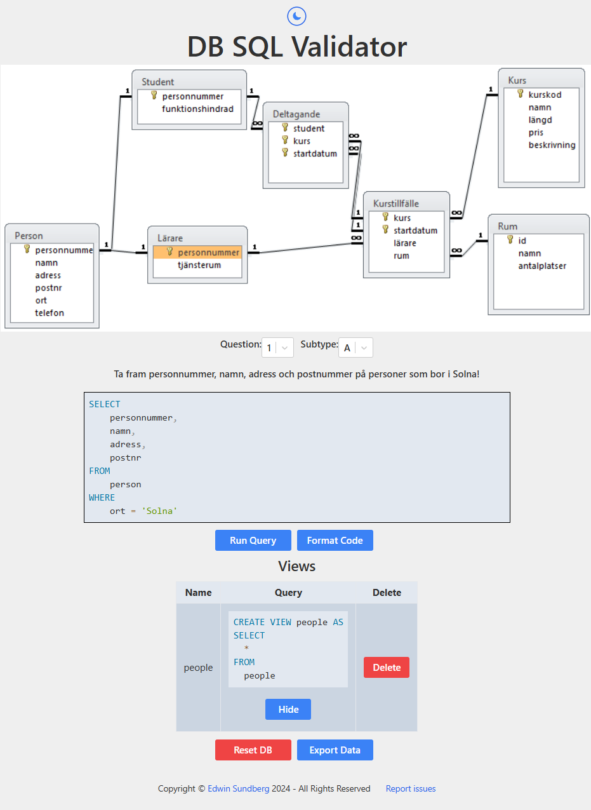
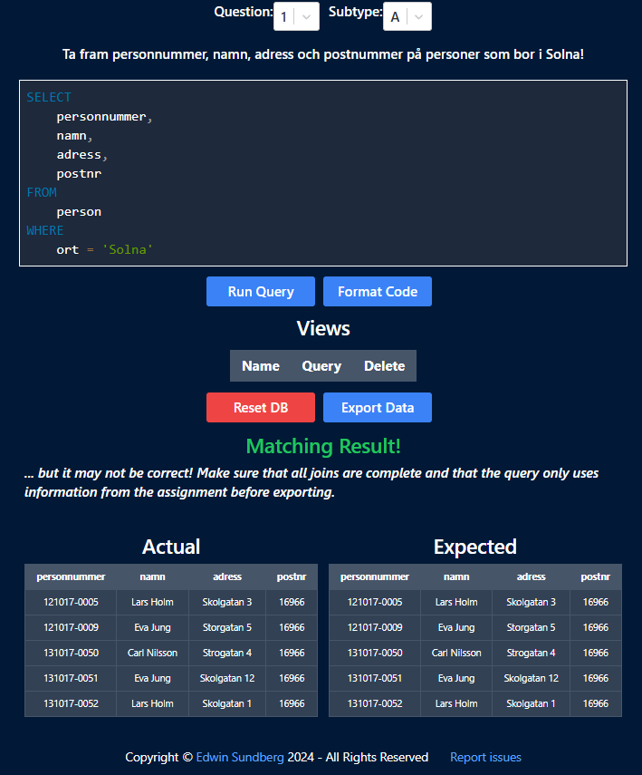
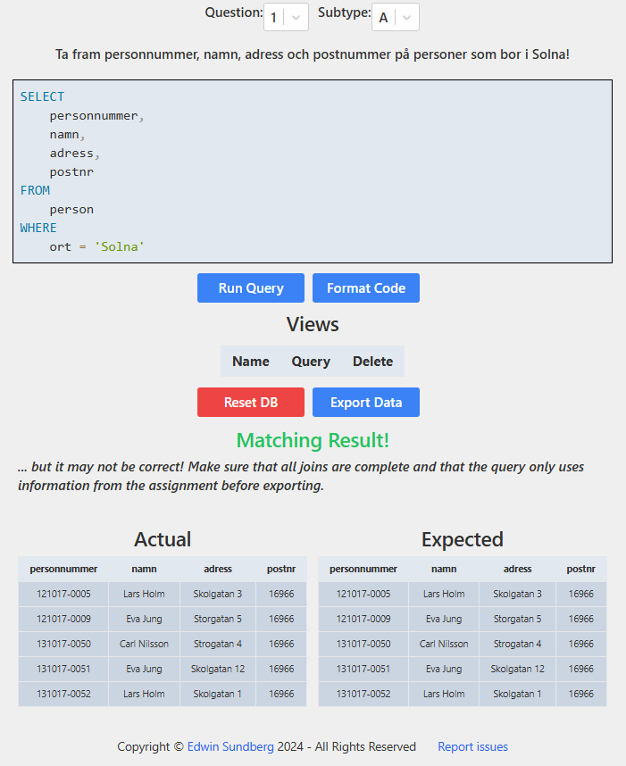

# SQL Validator
SQL Validator is a fully client-side web application powered by sql.js. Designed for the database course at Stockholm University, it provides an interface for students to write, format, and run SQL queries directly in their browser without the need for a database server. Results can be compared to expected results based on a question bank, and views can be created and managed using the browser's local storage.

## Features
- **Fully Client-Side Execution**: All SQL validation and execution is performed in the browser using sql.js SQLite.
- **SQL Editor**: A simple text editor with syntax highlighting and formatting.
- **Views Management**: Create, delete, and manage database views, stored in the browser's local storage.
- **Results Comparison**: Compare query results to expected results based on a question bank.
- **Dark/Light Mode**: Toggle between dark and light mode.
- **Export Data**: Export queries and views to file for sharing and/or backups.

## Usage
### Public Deployment
A public instance of SQL Validator is available at [https://sql-validator.e-su.se](https://sql-validator.e-su.se), powered with Cloudflare Pages.

### Running Locally
To deploy SQL Validator locally, follow these steps:
1. Clone the repository: `git clone https://github.com/Edwinexd/sql-validator.git`
2. Install dependencies: `npm install`
3. Start the development server: `npm start`

## Screenshots

    
    
    
    

## License
This project is licensed under the GNU General Public License v3.0. See the [LICENSE](LICENSE.md) file for more information.
